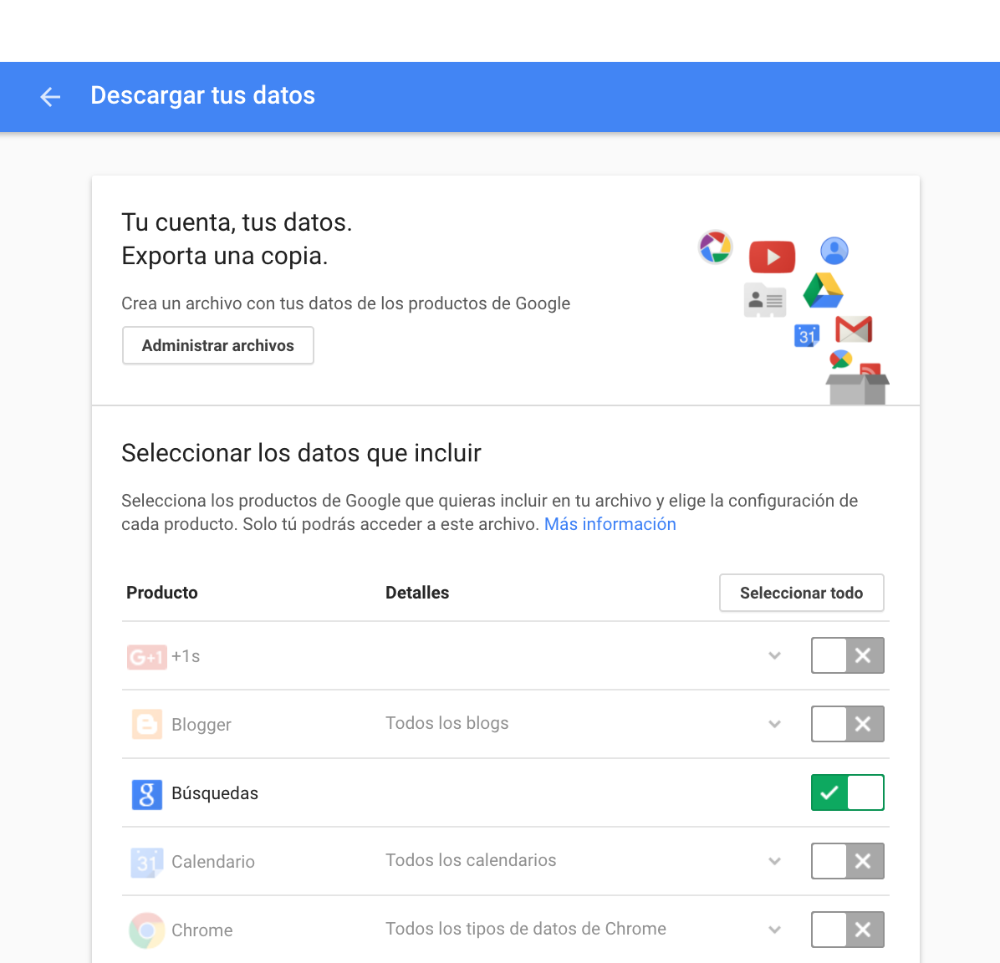
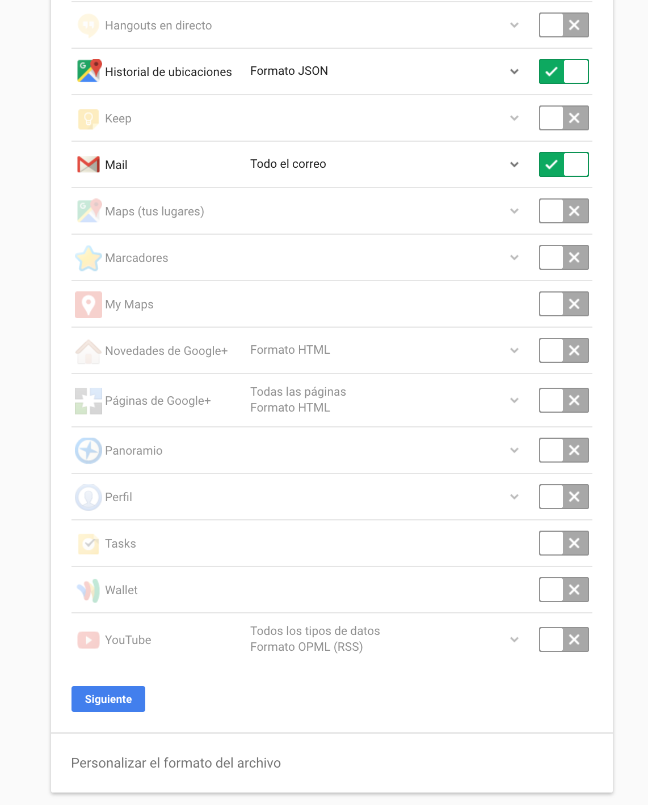
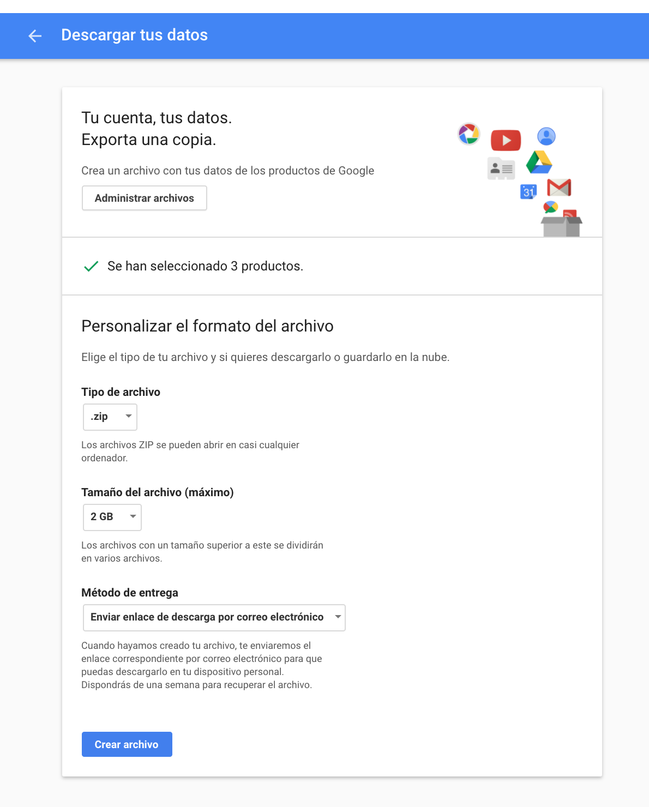

### Extract your Google data is free and accesible!

Google Takeout allows users to export their data from most of Google's services. Since its creation, Google has added several more services to Takeout due to popular demand for user.  
First of all you have to sign to your Google account.  

When signed in to Google, this service allows a plethora of data to be exported from an account - Mail, Contacts, Chrome settings, Hangouts chat history, location history, etc.

---
#### Get your data
Download your data in [Google Takeout](https://takeout.google.com/settings/takeout)  

After you enter to the link above, you will see a screen like this  

This is the Google applications panel, then you shall select **ONLY** Mail, Search History and Locations History, then tick next.  

Google is going to ask you how do you prefer download your files, so just leave the default options.  

After this Google will warning that you shall be patient to wait to get an email with the link for download the **zip** file. It is going to take a while, it depends on how big is your history, could take minutes, sometimes hours or even days.  

---
#### Analize your data

With the zip file in your hands (identify the path of your file) you are able to upload.   

**Let's Analyse!!**  

Go to the tab, and upload your zipfile, wait to see your future

---
#### References

If you want to get deeper you are welcome to read the research on about  

